# 📦 Votely: Microservice Voting App with Azure DevOps CI & Argo CD GitOps on Minikube

Welcome to **Votely**, a cloud-native microservice-based voting application! 🚀 In this guide, you'll learn how to deploy this app using **Azure DevOps (CI)** and **Argo CD (GitOps)** on **Minikube (local)**.

---

## 🛠️ Prerequisites

* Azure Free Trial or Student Subscription
* GitHub account
* Basic understanding of Azure DevOps and Kubernetes

---

## 1️⃣ Set Up Azure DevOps Environment

### 🔹 Create Azure DevOps Project

1. Sign up or log in to [Azure DevOps](https://dev.azure.com/).
2. Create a new **organization**.
3. Within the organization, create a new **project**.

### 🔹 Clone GitHub Repo to Azure Repo

1. Inside your Azure DevOps project, navigate to **Repos**.
2. Clone this GitHub repo into your Azure DevOps repo.

---

## 2️⃣ Set Up Azure Container Registry (ACR)

1. Go to the [Azure Portal](https://portal.azure.com/).
2. Create a new **Container Registry**.

---

## 3️⃣ Create Self-Hosted Agent (VM)

> ❗ Azure Free Tier does NOT support Microsoft-hosted agents.

### 🔹 Create a VM

1. Launch a Linux VM (Ubuntu recommended).
2. Login as `azureuser`.
3. Run `sudo apt update && sudo apt upgrade`

### 🔹 Install Docker

```bash
sudo apt install docker.io -y
sudo usermod -aG docker azureuser
```

### 🔹 Configure Self-Hosted Agent

1. In Azure DevOps project:

   * Go to **Project Settings** → **Agent Pools**
   * Create new pool: `azureagent`
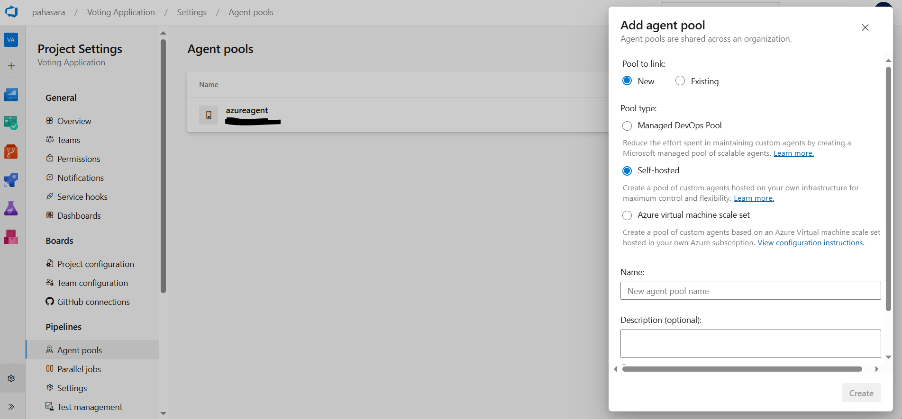
2. Click **New Agent** → Choose **Linux** → Follow instructions 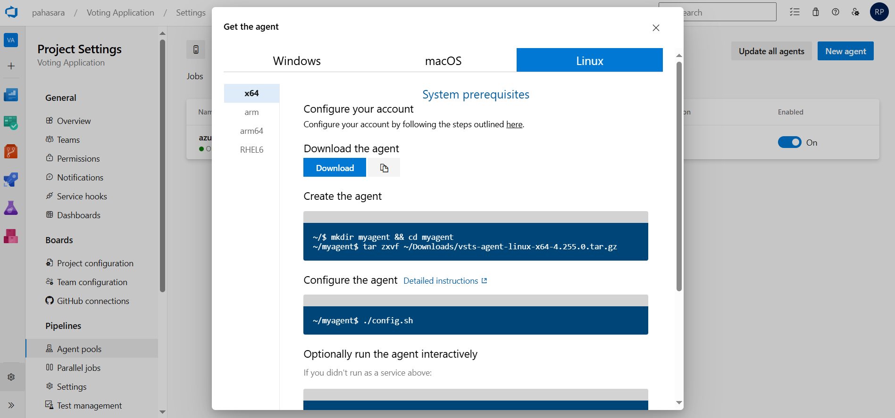
3. Generate a **Personal Access Token (PAT)**:

   * Click on your profile → **Security** → Create **PAT**
4. Complete agent configuration on the VM 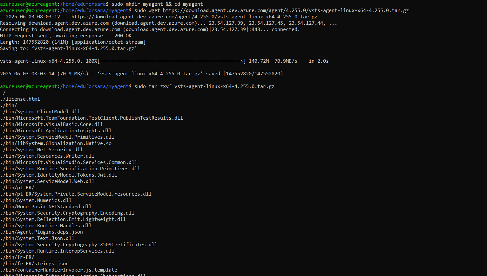 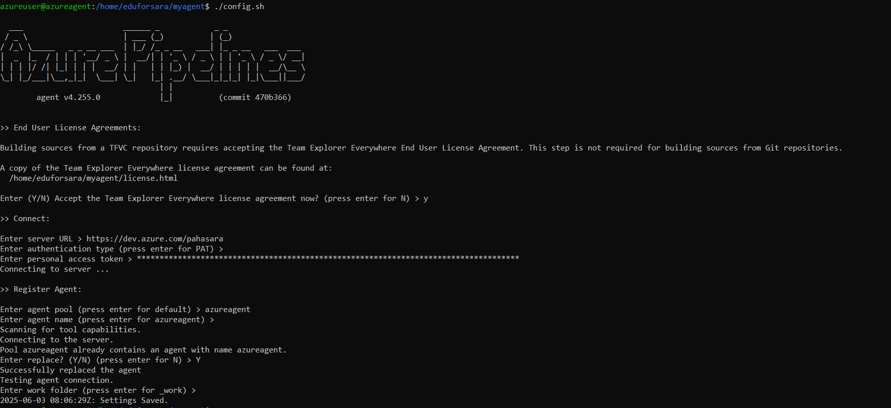
 
✅ Your VM is now ready and waiting for jobs!

---

## 4️⃣ Create CI Pipelines for Microservices

We will create **3 CI pipelines**:

* `vote`
* `result`
* `worker`

> 🛑 Skipping Redis and DB pipelines because they are stable third-party components not built by us. We deploy them with K8s manifests.

### 🔧 Pipeline Setup

1. Go to **Pipelines** → **New Pipeline** 
2. Connect to your Azure Repo → YAML file 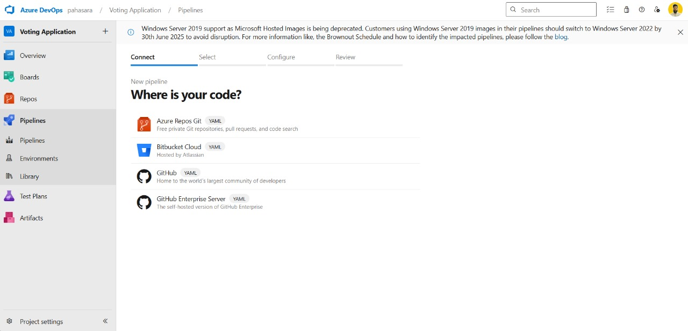 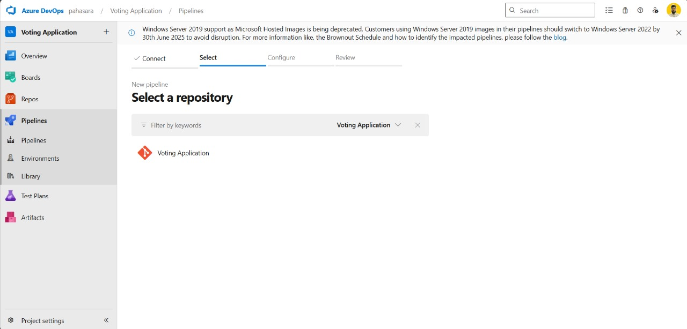 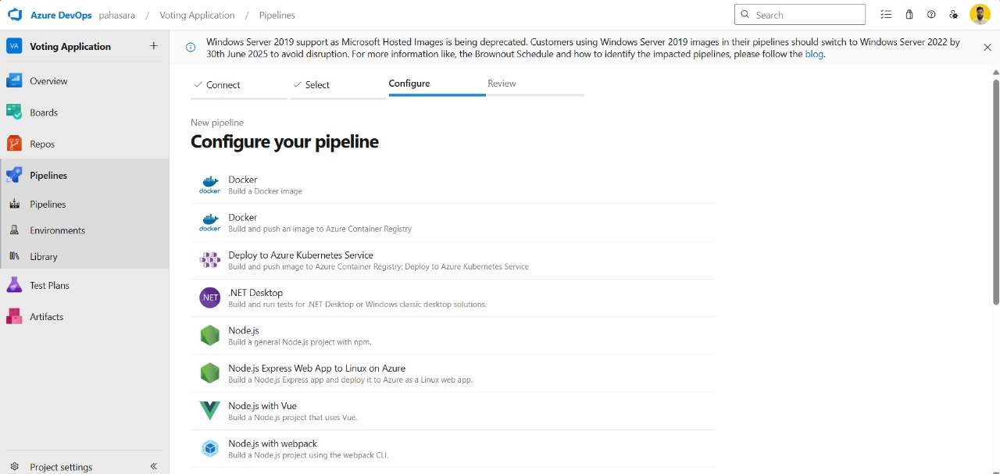 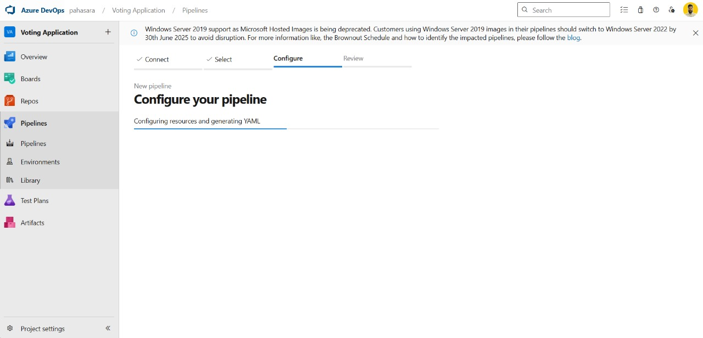
3. Ensure branch is set to `main`
4. Replace agent pool section:

```yaml
pool:
  name: 'azureagent'
```

5. Update paths under `variables:`

   * `dockerfilePath` as per each service

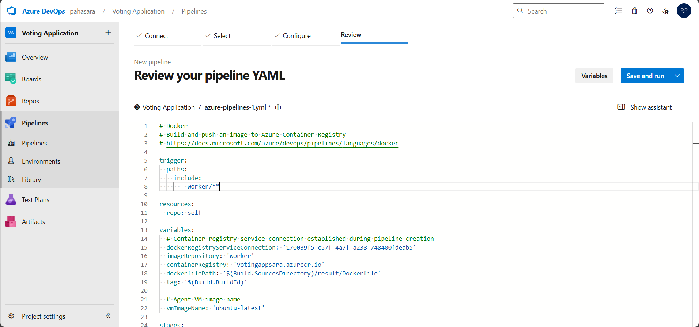

6. Add **Build** and **Push** stages

```yaml
# Docker
# Build and push an image to Azure Container Registry
# https://docs.microsoft.com/azure/devops/pipelines/languages/docker

trigger:
  paths:
    include:
      - worker/**

resources:
- repo: self

variables:
  # Container registry service connection established during pipeline creation
  dockerRegistryServiceConnection: 'aa7cd50b-c311-4f28-b9fd-fba71cf1d58b'
  imageRepository: 'worker'
  containerRegistry: 'votingappsara.azurecr.io'
  dockerfilePath: '$(Build.SourcesDirectory)/result/Dockerfile'
  tag: '$(Build.BuildId)'

pool:
  name: 'azureagent' 

stages:
- stage: Build
  displayName: Build stage
  jobs:
  - job: Build
    displayName: Build
    pool:
      name: 'azureagent'
    steps:
    - script: |
        echo "Cleaning agent work directory"
        rm -rf $(Pipeline.Workspace)/*
      displayName: "Clean full workspace"
      
    - checkout: self
      clean: true
      condition: 
    
    - script: |
        git reset --hard
        git clean -fdx
      displayName: "Force clean working directory"
    - task: Docker@2
      displayName: Build  an image 
      inputs:
        containerRegistry: '$(dockerRegistryServiceConnection)'
        repository: '$(imageRepository)'
        command: 'build'
        Dockerfile: '**/Dockerfile'
        tags: '$(tag)'

- stage: Push
  displayName: Push stage
  jobs:
  - job: Push
    displayName: Push
    pool:
      name: 'azureagent'
    steps:
    - script: |
        echo "Cleaning agent work directory"
        rm -rf $(Pipeline.Workspace)/*
      displayName: "Clean full workspace"
      
    - checkout: self
      clean: true
      condition: 
    
    - script: |
        git reset --hard
        git clean -fdx
      displayName: "Force clean working directory"
    - task: Docker@2
      displayName: Push an image to container registry
      inputs:
        containerRegistry: '$(dockerRegistryServiceConnection)'
        repository: '$(imageRepository)'
        command: 'push'
        tags: '$(tag)'
```

7. Run pipeline ✅

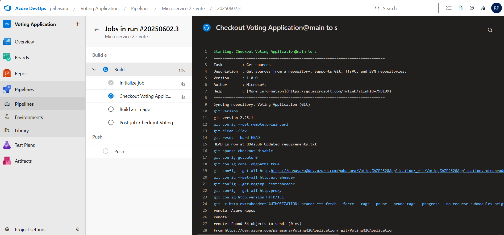
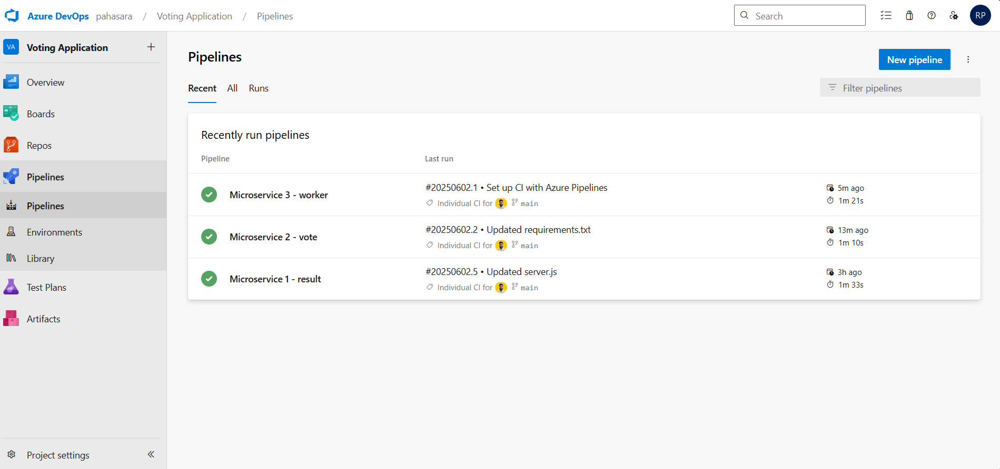

9. Repeat steps for `worker` and `result` services


---

## 5️⃣ Set Up Local CD Environment (Minikube + Argo CD)

### 🔹 Install Minikube with Docker Driver

```bash
minikube start --driver=docker
```

### 🔹 Install Argo CD

```bash
kubectl create namespace argocd
kubectl apply -n argocd -f https://raw.githubusercontent.com/argoproj/argo-cd/stable/manifests/install.yaml
```

### 🔹 Access Argo CD UI

```bash
kubectl port-forward svc/argocd-server -n argocd 8080:443
```

Navigate to [https://localhost:8080](https://localhost:8080)

### 🔐 Login to Argo CD

```bash
kubectl get pods -n argocd
kubectl -n argocd get secret argocd-initial-admin-secret -o jsonpath="{.data.password}" | base64 -d && echo
```

Username: `admin`
Password: *from above*

---

## 🔗 Connect Azure Repo to Argo CD

### 🔹 Add Repository

1. In Argo CD → Settings → Repositories
2. Click **Connect Repo**
3. Method: **HTTPS**
4. Repo URL format:

```plaintext
https://<PAT>@dev.azure.com/<org>/<project>/_git/<repo>
```

5. Choose **project: default** and click **Connect**

---

## 🧩 Create Application in Argo CD

1. Go to **Applications** → **New App**
2. App Name: `votely`
3. Project: `default`
4. Sync Policy: `automatic`
5. Repo URL: (same as above)
6. Path: path to your `k8smanifests` folder
7. Cluster: `https://kubernetes.default.svc`
8. Namespace: `default`
9. Click **Create**

📌 Argo CD will now watch your manifests folder and apply changes automatically.

---

## 🐚 Automate Image Update in Deployment Manifest

After CI builds and pushes images, the new image version must be updated in the `deployment.yml` file.

### 📝 Create Shell Script

1. Create folder: `scripts`
2. Inside, create `update-image.sh`

```bash

#!/bin/bash

set -x

# Set the repository URL
REPO_URL="https://<PAT>@dev.azure.com/pahasara/vote-app/_git/vote-app"

# Clone the git repository into the /tmp directory
git clone "$REPO_URL" /tmp/temp_repo

# Navigate into the cloned repository directory
cd /tmp/temp_repo

# Make changes to the Kubernetes manifest file(s)
# For example, let's say you want to change the image tag in a deployment.yaml file
sed -i "s|image:.*|image: votingappsara.azurecr.io/$2:$3|g" k8s-specifications/$1-deployment.yaml

# Add the modified files
git add .

# Commit the changes
git commit -m "Update Kubernetes manifest"

# Push the changes back to the repository
git push

# Cleanup: remove the temporary directory
rm -rf /tmp/temp_repo

```

### 🔧 Add New Stage to CI Pipelines

* Create a new stage: `update-manifest`
* This will execute `update-image.sh`

```yaml
- stage: Update
  displayName: Update 
  jobs:
  - job: Update
    displayName: Update
    pool:
      name: 'azureagent'
    steps:
    - script: |
        echo "Cleaning agent work directory"
        rm -rf $(Pipeline.Workspace)/*
      displayName: "Clean full workspace"

    - checkout: self
      clean: true
      condition: 
    
    - script: |
        git reset --hard
        git clean -fdx
      displayName: "Force clean working directory"
      
    - script: |
        sed -i 's/\r$//' scripts/updateK8sManifests.sh
        chmod +x scripts/updateK8sManifests.sh
      displayName: "Fix Line Endings"
    - task: ShellScript@2
      displayName: update the image on Manifest file
      inputs:
        scriptPath: 'scripts/updateK8sManifests.sh'
        args: 'worker $(imageRepository) $(tag)'
```

---

## 🔐 Accessing the Application

### 🔹 Create Docker Registry Secret in Minikube

```bash
kubectl create secret docker-registry acr-secret \
  --docker-username=<username> \
  --docker-password=<password> \
  --docker-email=<email> \
  --docker-server=https://index.docker.io/v1/
```

### 🔹 Update K8s Deployment Files

Add this under each `deployment.yml` → `spec.template.spec`

```yaml
imagePullSecrets:
  - name: acr-secret
```

### 🔹 Expose Services via LoadBalancer

In each `service.yml`, add:

```yaml
spec:
  type: LoadBalancer
  ports:
    - port: <your-port>
```

> ⚠️ Avoid port `8080` — it's used by Argo CD!

---

## ✅ Final Test

1. Make a code or image change
2. Push to repo → CI pipeline runs → New image pushed
3. Shell script updates manifest
4. Argo CD detects manifest change → Deploys update


5. 🎉 Access services via `localhost:<port>`
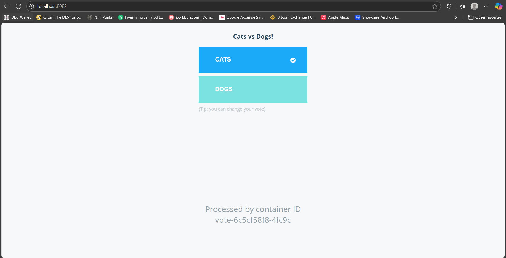
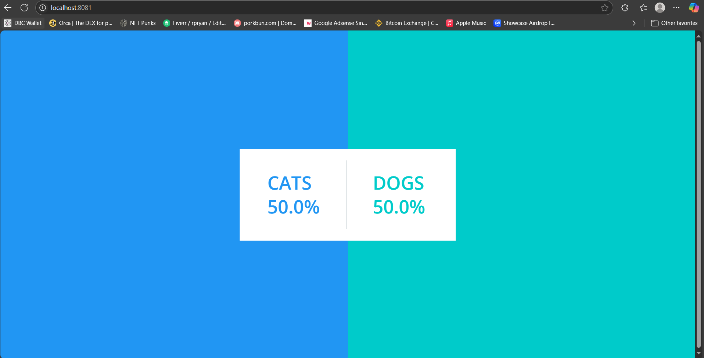
---

## 📁 Folder Structure Example

```plaintext
.
├── vote
├── result
├── worker
├── k8smanifests
│   ├── vote
│   ├── result
│   ├── worker
│   ├── redis
│   └── db
├── scripts
│   └── update-image.sh
└── README.md
```

---

## 🙌 Contributions & Acknowledgments

Feel free to fork this repo and improve the deployment setup. PRs are welcome!

Thanks to Azure, Kubernetes, and Argo CD for making DevOps awesome! 💙
